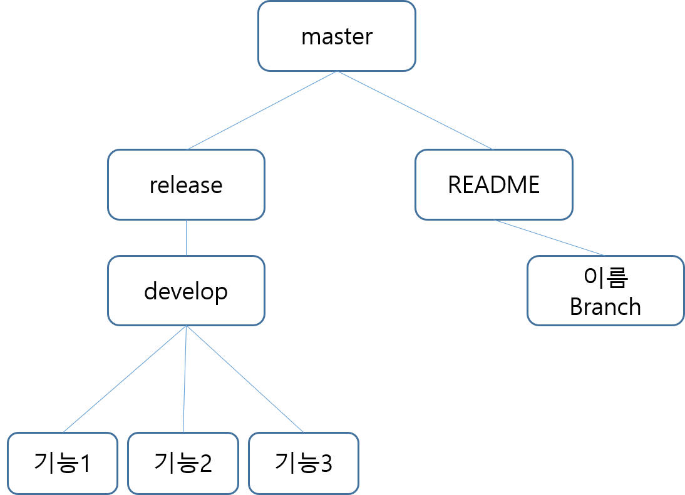

# 2022.03.07

### 오늘의 할 일

- [x] 아침 조회
- [x] 지라 이번주 스프린트 생성 및 이슈 넘겨놓기
- [x] 팀 프로젝트 규칙 정하기
- [x] 프로젝트 기획
- [x] 자치회 회의 참여

### 아침 조회

**1️⃣ 팀 프로젝트 규칙 정하기**

👉 깃 / 지라 관련 회의 ✔

		- 지라 담당자 : 이소영
		- Git Branch 구조 및 규칙 정하기

👉 프로젝트 집중 시간 : 9 to 6 (일단 이번주만 진행) ✔

2️⃣ 팀 별 깃 / 지라 생성 ✔

3️⃣ 4차 도메인에 대한 기본 개념 이해 및 정리

👉 정리해주는 사람이 따로 있으면 좋을듯? (아직 미정)

4️⃣ 주제 선정(기획)  v0.1

5️⃣ 각 팀원별 프로젝트 진행 (always)

### Git Branch 구조 및 규칙 

| 태그 이름        | 설명                                                  |
| ---------------- | ----------------------------------------------------- |
| Feat             | 새로운 기능을 추가할 경우                             |
| Fix              | 버그를 고친 경우                                      |
| Edit             | 코드를 수정한 경우                                    |
| Design           | CSS 등 사용자 UI 디자인 변경                          |
| !BREAKING CHANGE | 커다란 API 변경의 경우                                |
| !HOTFIX          | 급하게 치명적인 버그를 고쳐야 하는 경우               |
| Style            | 코드 포맷 변경, 세미 콜론 누락, 코드 수정이 없는 경우 |
| Refactor         | 프로덕션 코드 리팩토링                                |
| Comment          | 필요한 주석 추가 및 변경                              |
| Docs             | 문서를 수정한 경우                                    |
| Test             | 테스트 추가, 테스트 리팩토링(프로덕션 코드 변경 X)    |
| Chore            | 빌드 테스트 업데이트, 패키지 매니저를 설정하는 경우   |
| Rename           | 파일 혹은 폴더명을 수정하거나 옮기는 작업만인 경우    |
| Remove           | 파일을 삭제하는 작업만 수행한 경우                    |

### 프로젝트 기획

1️⃣ 기존 기획안 리뷰

2️⃣ 전문가 리뷰 시간 대비 Q&A 보완

3️⃣ 기획 아이디어 관련 데이터 찾고 다시 생각해보기

### 일과 후 할 일

1️⃣ 기획 관련 아이디어 찾아보기

2️⃣ 리드미 작성 관련 지라 넘기기

3️⃣ 하둡 개인 학습