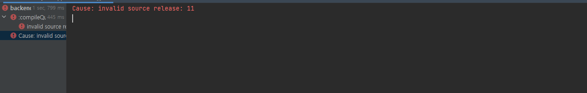

# 2022.03.23

### ✔ 오늘의 할 일

- [x] 유튜브 시청 - 파이썬 데이터 분석 플랫폼(주피터 노트북)
- [x] 유튜브 시청 - 금융시스템vs블록체인

- [x] 공지사항 게시판 구현 시작

### ❓ 오늘 발생한 에러

Cause: invalid source release: 11 에러 발생

👉 해결법

Project Structure에서 SDK를 1.8 > 11로 변경하기

### 📁 일과 후 할 일

1️⃣ JPA 학습

2️⃣ 공지사항 게시판 구현 진행

3️⃣ 알고리즘 학습